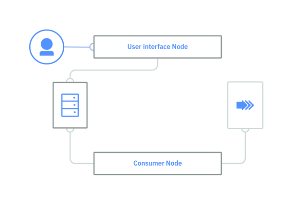
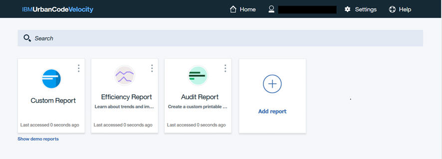

# Concepts

The UrbanCode™ Velocity Community Edition architecture allows for continuable access to your UrbanCode Deploy deployment data without impacting its performance.

UrbanCode Velocity is installed in a Docker Compose or Kubernetes container management system. A MongoDB database is also required and installed in a separate container. After a connection is made to a source-control repository, the data is mined automatically from the repository and maintained on the MongoDB. There are two UrbanCode Velocity components and each resides in a separate container.

-   The User Interface node which provides access UrbanCode Velocity features.
-   The Consumer node which serves as the communication vehicle between the repository and the MongoDB database.

A typical flow includes the following:

-   A defined user requests a report using the UrbanCode Velocity user interface available through a web browser.
-   The request is sent to the MongoDB database to format the report and return it to the user interface. The report is viewed from the interface and filters can be applied to focus on specific portions of the data. Reports can also be based on logical grouping of applications and lines of businesses.
-   The MongoDB database is refreshed every fifteen minutes with updates from the UrbanCode Deploy server. The Consumer Node provides communication between UrbanCode Deploy server and the MongoDB database and ensures that data is synchronized on a fifteen minute interval. The synchronized data is maintained in the MongoDB database ready for the next report request, which eliminates performance issues for the UrbanCode Deploy server.

## Home page

You access the UrbanCode Velocity interface using a web browser. The user interface URL is provided by your administrator. To have access to the interface, the administrator must have authenticated your access. After providing your credentials, the Home page displays. From the Home page, you can request and create a report. For a report to contain data, the administrator must have completed integration with one or more UrbanCode Deploy servers. 

Each report is represented by a tile on the Home page. You have access to the predefined reports, reports that you create, and reports that other users have shared with you. All these will be available from your Home page. Any report that you have access to, you also have the ability to customize the data viewed using filters. The available filters depend on the report. Clicking the tile provides associated details and allows you to work the pipeline, release, or report selected. Use the  icon o rename or remove the report.

If you have administrator privileges, there are several functions available by clicking **Settings** on the task bar. Administrators can:

-   Integrate repositories
-   Authenticate users
-   Map environments into groups
-   Create logical line of business groups

