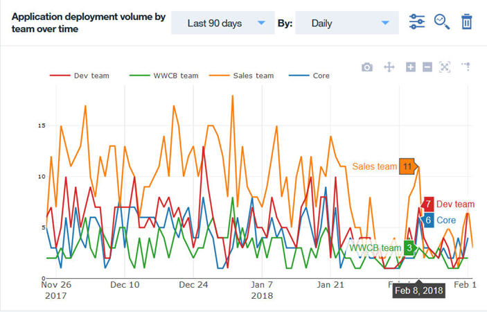

# Charts

The **Report details** section of a report displays the various elements containing report details. Each element is referred to as a chart.

A chart is a physical representation of data for a specified reporting period. Charts can be a line graph, bar chart, or a table depending on the data gathered.

You can select any number of charts to display in a report. The following types of charts are available.

-   Application deploys
    -   Total application deployment counts by environment
    -   Total application deployment counts by team and environment
    -   Application deployment failure counts by environment
    -   Application deployment success counts by environment
    -   Application deployment failure counts by team and environment
    -   Application deployment volume by environment over time
    -   Application deployment volume by team over time
    -   Recent application deployment activity
    -   Application deployment volume by line of business over time
-   Component deploys
    -   Total component deployment count by application and environment
    -   Total component deployment count by team and environment
    -   Component deployment failure count by application and environment
    -   Component deployment failure count by team and environment
    -   Component deployment success count by application and environment
    -   Component deployment volume by environment over time
    -   Component deployment volume by team over time
    -   Recent component deployments by environment
-   Applications
    -   Application onboarded over time

Each line graph chart contains a header with a number of tasks that can be performed on the chart. At the left of the task bar are the following icons:

-   ****

    Edit the filters to narrow or broaden the data in the chart. You can filter data by time, environment, application, team, line of business, and deployment results.

-   ****

    View the actual data used to create the chart.

-   ****

    Delete the chart.

Additional tasks are available when the cursor is within the graph itself. You can download the graph as a PNG filetype, pan the graph, zoom in and out, scale the graph, and toggle spike lines using the icons that appear within the graph \(\).

When hovering the cursor at various locations on the graph, information about the lines is displayed, such what each line represents and the value at the cursor location. 

## Detail pages

For the line graph charts, you can view the data details in a table format. The table can be re-formatted to hide columns that are not important at the time and column reordered. Click the table design icon \(\) to hide and show the defined columns. 

Data can be filtered,

CSV files download detail data

**Parent topic:** [Custom reports](../../com.insights.doc/topics/c_reports_custom.md)

